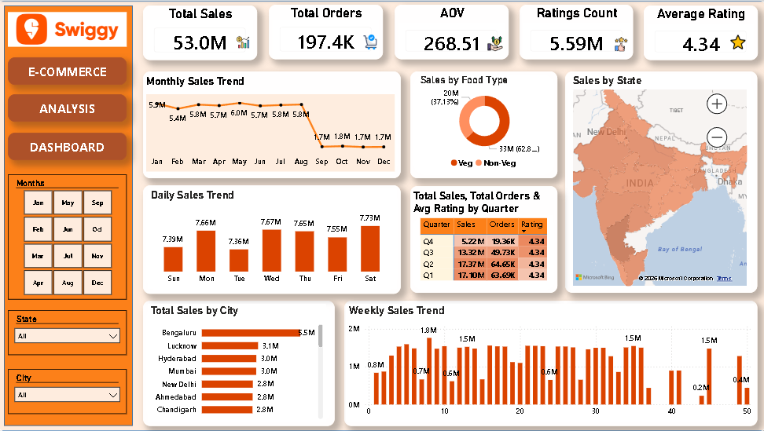
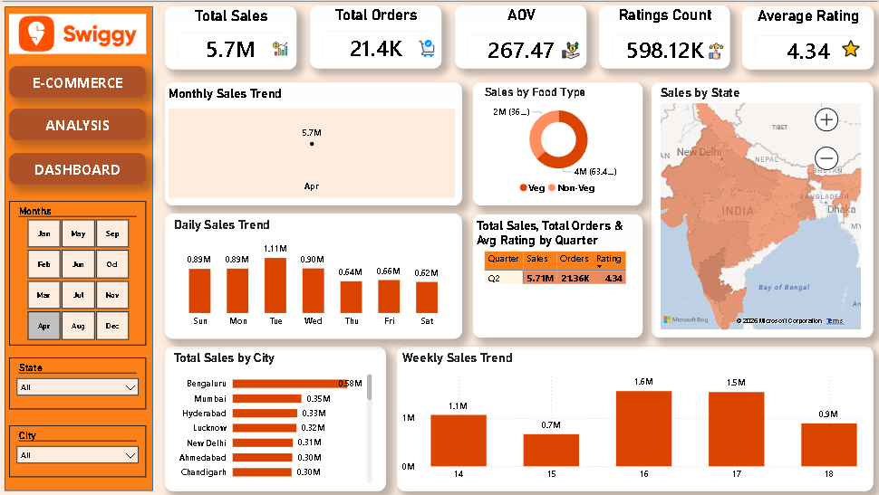
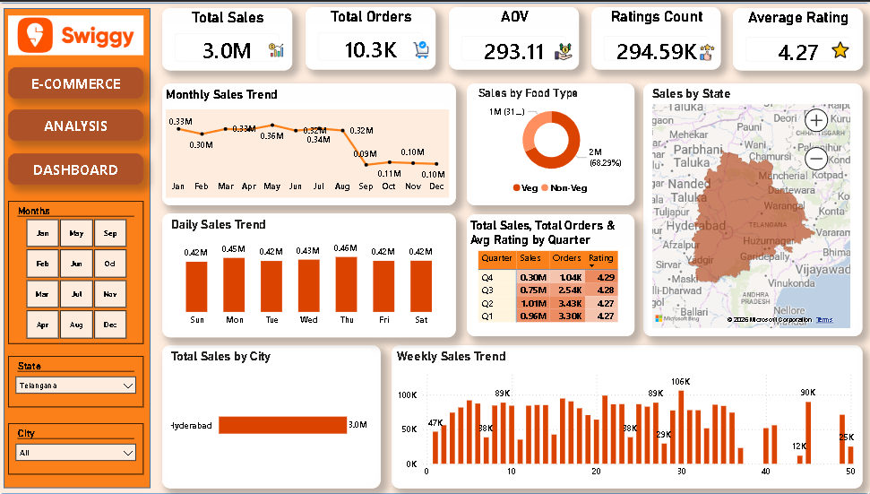
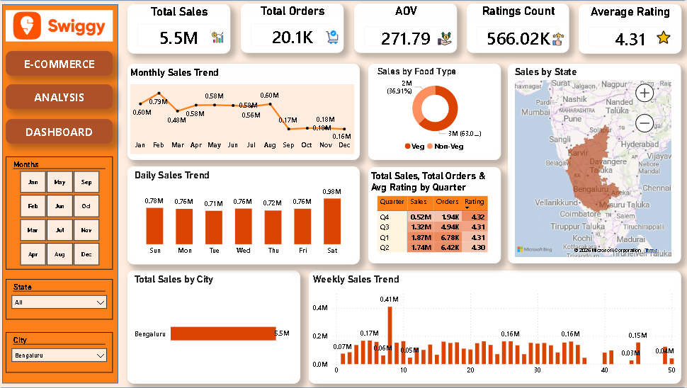

## 🛵 Swiggy E-Commerce Analytics Dashboard

## Project Overview

This Power BI Swiggy E-Commerce Analytics Dashboard provides insights into sales performance, order trends, customer ratings, food category preferences, and city-wise sales distribution. The dashboard helps identify top-performing locations, customer behavior patterns, and overall business performance.

## Key Features

- Total Sales Analysis
- Total Orders Tracking
- Average Order Value (AOV) Analysis
- Customer Ratings Analysis
- Monthly Sales Trend Analysis
- Daily & Weekly Sales Trend Analysis
- Food Category Performance
- State-wise Sales Distribution
- City-wise Sales Analysis
- Interactive Filters and Slicers

## Tools Used

- Power BI
- Power Query
- DAX
- Excel

## Dashboard Preview

## Files Included

- swiggy_dashboard.pbix
- Swiggy_ECommerce_Analytics_Dashboard.mp4
- swiggy1.png
- swiggy2.png
- swiggy3.png
- swiggy4.png

## Skills Demonstrated

- Data Cleaning
- Data Modeling
- DAX Calculations
- E-Commerce Analytics
- Dashboard Design
- Data Visualization

## Business Insights

- Vegetarian food contributed the majority of total sales.
- Average customer rating remained above 4.3, indicating strong customer satisfaction.
- Sales were relatively stable during the first eight months and declined in the final quarter.
- Bengaluru emerged as the top-performing city in terms of sales revenue.
- Weekend sales showed stronger performance compared to some weekdays.
- Order volume and sales trends highlighted opportunities for seasonal marketing campaigns.
